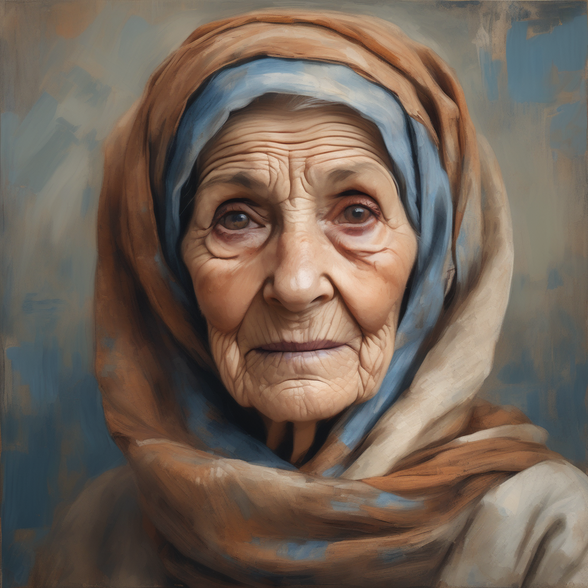

# PRIS-CV/DemoFusion Cog model

This is an implementation of [PRIS-CV/DemoFusion](https://github.com/PRIS-CV/DemoFusion/tree/main) as a [Cog](https://github.com/replicate/cog) model.

## Development

Follow the [model pushing guide](https://replicate.com/docs/guides/push-a-model) to push your own model to [Replicate](https://replicate.com).

## Basic Usage

Then for predictions,

    cog predict -i prompt="Envision a portrait of an elderly woman, her face a canvas of time, framed by a headscarf with muted tones of rust and cream. Her eyes, blue like faded denim. Her attire, simple yet dignified"

# Example

